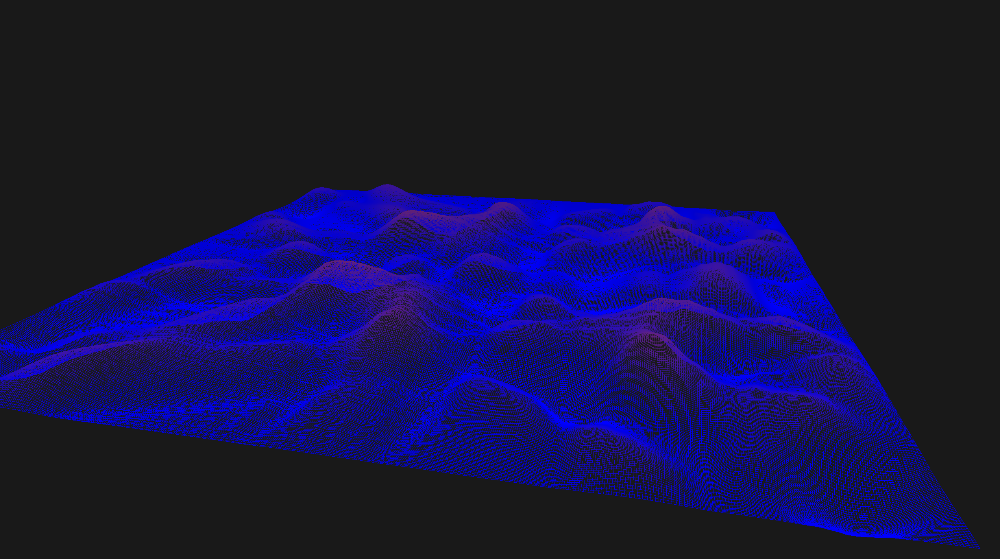
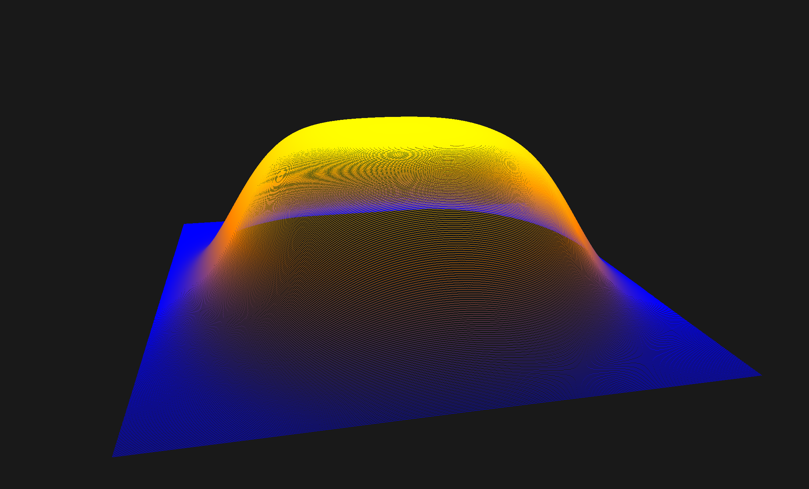

# Numerical
This repository contains implementations for various numerical methods for educational purposes.

## Wave Program


Currently the main script launches numerical solver of a wave equation. To launch it use:
```zsh
> ./main -w [width] -h [height] -t [time_step] -x [space_step]
```
In order to launch GL-window use:
```zsh
> ./mainWindow -w [width] -h [height] -t [time_step] -x [space_step]
```

## Heat Program



